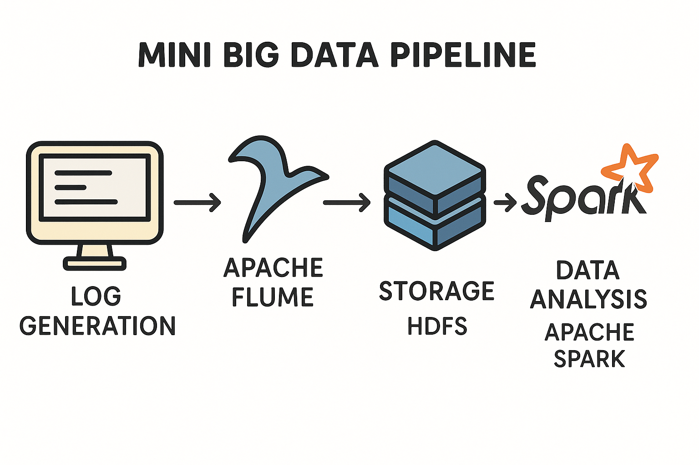
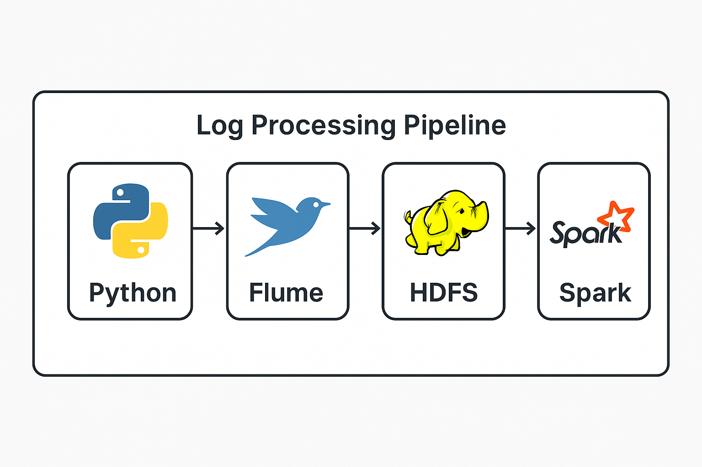

# 🚀 Big Data Log Processing Pipeline


 


> A mini Big Data pipeline that demonstrates real-time log generation, ingestion using Apache Flume, storage in HDFS, and data analysis using Apache Spark.

---

## 📌 Project Overview

This project was developed as the final project for the **Big Data Analysis Course at NTI**. It simulates a real-time log processing system using popular big data tools.

The pipeline consists of:

1. **Python script** generating synthetic log data.
2. **Apache Flume** capturing and ingesting logs.
3. **HDFS** storing logs in a structured format.
4. **Apache Spark** analyzing and extracting insights from the logs.

---

## 🔄 System Architecture


> *Figure: Overview of the log processing pipeline showing integration of Python, Flume, HDFS, and Spark.*

---

## 📂 Project Structure

```bash
logToFlumeHDFS_Spark/
│
├── log_generator/
│   └── logGen.py       # Python script to generate log data
│
├── flume_config/
│   └── exercise5.conf         # Apache Flume configuration file
│
├── spark_analysis/
│   ├── analysis.ipynb         # Jupyter Notebook for log analysis
│   └── analysis.py            # PySpark script (optional CLI version)
│
├── ReadmeFigures/
│   ├── banner.png             # Project banner image
│   ├── Mini_BigDataPipeline_simple_compose.png # Project pipeline diagram
│   └── demo.gif               
│
└── README.md

```


## 🔧 Setup Instructions

### 1️⃣ Generate Logs

```bash
python3 log_generator/generate_logs.py
```

### 2️⃣ Start Apache Flume Agent

```bash
$FLUME_HOME/bin/flume-ng agent \
  -c $FLUME_HOME/conf/ \
  -f flume_config/exercise5.conf \
  --name a1 \
  -Dflume.root.logger=INFO,console
```

### 3️⃣ View Data in HDFS

```bash
hdfs dfs -ls /tmp/logGenED/
```

### 4️⃣ Analyze Logs with Spark

Using `pyspark` shell:

```python
df = spark.read.text("/tmp/logGenED/...")
# Add transformations here...
```

Or use the Jupyter Notebook in `spark_analysis/`.

---

## 📊 Sample Output


> *Figure: Sample result showing log counts by level using PySpark.*

---

## 🎥 Demo


> *Figure: Animated demo showing real-time log generation and analysis.*

---

## 🛠️ Technologies Used

* 🐍 Python 3
* 🔥 Apache Flume
* 🐘 HDFS (Hadoop Distributed File System)
* ⚡ Apache Spark (PySpark)
* 📁 Jupyter Notebook

---

## 📚 Future Work

* Add Kafka integration instead of Flume.
* Store in Parquet/Avro format.
* Create dashboards using Apache Superset or Power BI.
* Containerize the system using Docker.

---

## 🤝 Acknowledgements

Developed during the NTI Big Data Analysis Course
Special thanks to the instructors and course team.

---

## 📬 Contact

**Abdelrahman Anwar**
For questions, feedback, or collaboration, feel free to reach out:

- **Emial**: [abd.ahm.anwar@gamil.com](mailto:abd.ahm.anwar@gamil.com)
- **GitHub**: [Abdo-Anwar](https://github.com/Abdo-Anwar)
- **LinkedIn**: [abdelrhman-anwar](https://www.linkedin.com/in/abdelrhman-anwar)


